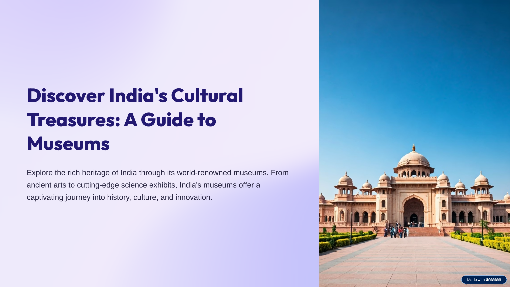
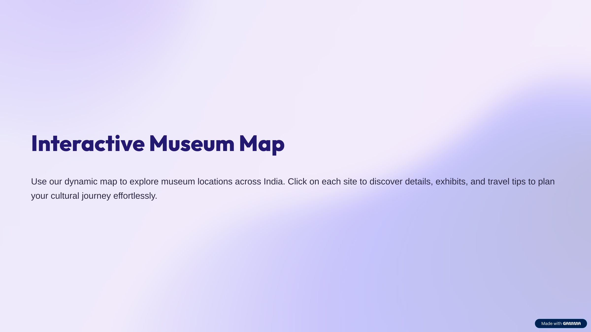
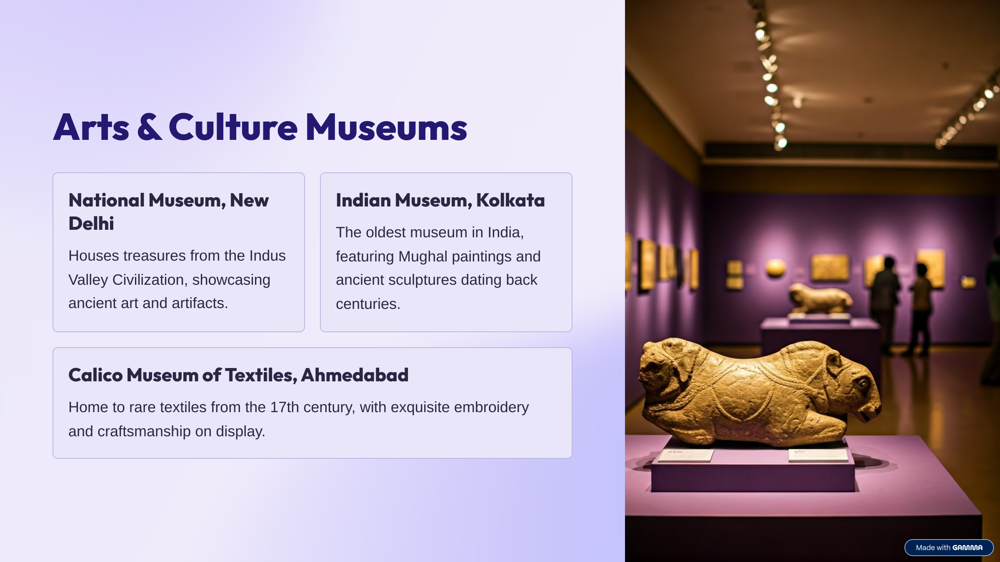
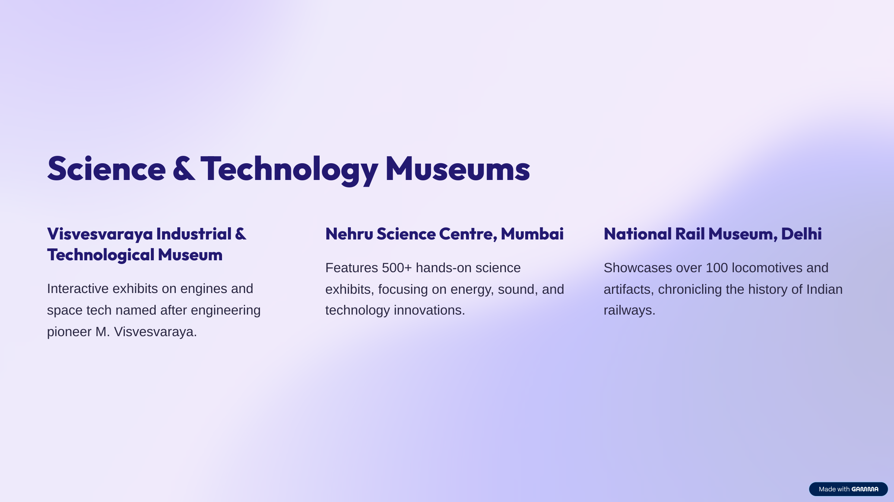
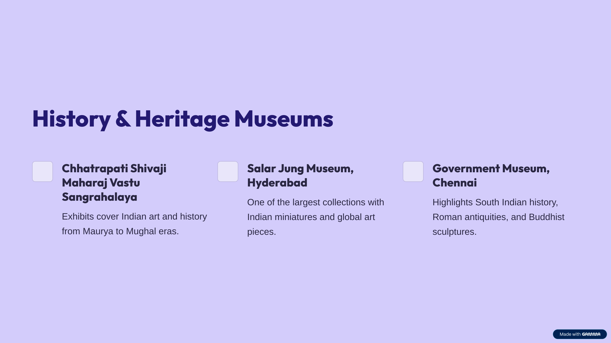
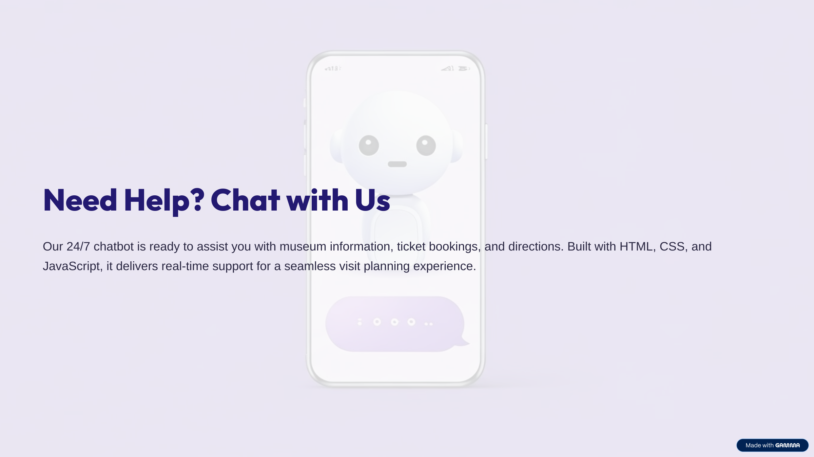

<div align="center">
  
  <h1>🖼️ AIBot MuseBot</h1>
  <p><b>Discover India's Museums & Cultural Treasures with AI</b></p>
  <a href="https://aibot-musebot-byvoxnova-hackthonproj.netlify.app"></a>
</div>

---

## ✨ Overview

<p align="center">
  
</p>

<b>AIBot MuseBot</b> is your AI-powered guide to India's rich museum landscape. Explore, plan, and interact with museums across the country—arts, science, history, and more—all in one place!

---

## 🚀 Features

- 🗺️ <b>Interactive Museum Map</b>: Find museums by region and type
- 🤖 <b>AI Chatbot</b>: Get instant help and recommendations
- 🖼️ <b>Gallery</b>: Browse images and highlights from top museums
- 📅 <b>Plan Your Visit</b>: Tips, timings, and must-see exhibits
- 🏛️ <b>Categories</b>: Arts, Science, History, Heritage, and more

---

## 🖼️ Screenshots

<p align="center">
  
  
  
</p>

---

## 🌐 Live Demo

👉 [Try MuseBot Now!](https://aibot-musebot-byvoxnova-hackthonproj.netlify.app)

---

## 🏗️ Tech Stack

- HTML5, CSS3, JavaScript
- Responsive Web Design
- AI-powered chatbot (front-end logic)

---

## 📂 Project Structure

```
aibot-musebot-byvoxnova/
├── index.html
├── script.js
├── styles.css
├── images/
│   └── ... (UI images & icons)
├── museimage/
│   └── ... (museum photos)
└── README.md
```

---

## 🙏 Credits

- Project by <b>VoxNova Team</b>
- Images: Project assets & open sources
- Icons: [Font Awesome](https://fontawesome.com/) & [Shields.io](https://shields.io/)

---

<div align="center">
  
  <br/>
  <b>Need help? Chat with MuseBot!</b>
</div>
